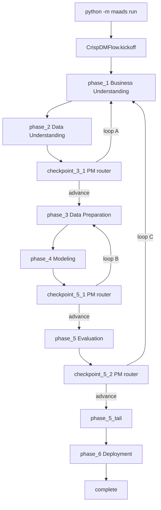

# maads architecture

## Overview

maads runs a CRISP-DM pipeline using **CrewAI Flow** as the workflow engine and **phase-scoped crews** for agent collaboration. Shared run state lives in `CrispDMState`; deterministic Python execution stays in `capabilities/`.

## Control flow

## Module layout

| Path | Role |
|------|------|
| `flow/crisp_dm_flow.py` | `@start` / `@listen` / `@router` flow graph |
| `flow/phase_runner.py` | Shared substep dispatch, advance, loops, caps |
| `flow/routers.py` | PM checkpoint routing helpers |
| `flow/tracing.py` | Trace + status flush hooks for flow steps |
| `crews/*_crew/` | Phase-scoped `@CrewBase` crews with YAML config |
| `capabilities/` | Sandbox execution + JSON apply |
| `state.py` | `CrispDMState` — single source of truth |

## Substep dispatch

Each substep:

1. `capabilities.execution_evidence` (when applicable)
2. Phase crew `kickoff_substep` → one-agent Crew kickoff
3. `capabilities.apply_response`

## Artifacts

Unchanged: `status.json`, `process.json`, `state.json`, `trace/` under `artifacts/<case>/runs/<run_id>/`.

## CLI

- `python -m maads run --case titanic` — runs via `CrispDMFlow`
- `python -m maads flow plot` — HTML graph of `CrispDMFlow`
