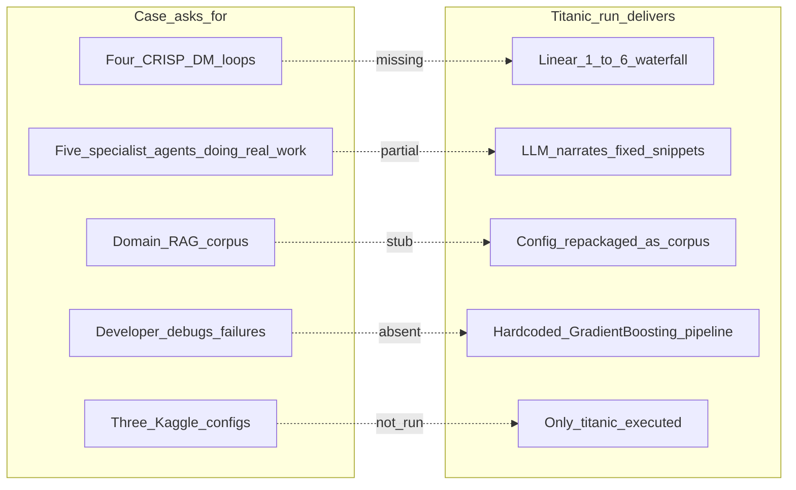

# Project Plan — Multi-Agent CRISP-DM System

> Grounded in the Titanic trace audit (`[artifacts/titanic/trace/](../artifacts/titanic/trace/)`, run `21e1d2ac-cd14-450b-b4a7-89223d8e5bf6`) against the [Marchev-Science case requirements](https://github.com/Marchev-Science/case-multi-agent-system-for-automated-data-science).

## Executive verdict

The Titanic run **technically finishes** (valid `submission.csv`, CV ~81.6%, trace artifacts generated), but it **fails the spirit of the case** on most discriminating criteria: iterative CRISP-DM loops, genuine agent-owned execution, Developer-as-debugger, RAG-grounded domain expertise, token economy, three-dataset generality, and deliverables (architecture doc + paper).

**Estimated case checklist: ~3/9 success criteria met** (end-to-end run, observable agents, Kaggle-valid submission). The system is closer to a **scaffolded demo** than a research-grade automated data-science MAS.




---

## What the run got right


| Criterion                         | Evidence                                                                                                               | Notes                                                                   |
| --------------------------------- | ---------------------------------------------------------------------------------------------------------------------- | ----------------------------------------------------------------------- |
| End-to-end, no human intervention | `[status.md](../artifacts/titanic/status.md)`: halted at 6.4 after ~78 min                                             | Runnable via `python -m maads run --case titanic`                       |
| Five agents visible in trace      | `[flowchart.mmd](../artifacts/titanic/trace/flowchart.mmd)`, `[narrative.md](../artifacts/titanic/trace/narrative.md)` | Orchestrator → domain / data_engineer / data_scientist / pm / developer |
| Kaggle-valid submission           | 418 rows, `PassengerId,Survived`, int dtypes                                                                           | Beats config threshold on **CV** (0.816 vs 0.77)                        |
| Typed CRISP-DM state              | `[final_state.json](../artifacts/titanic/final_state.json)`                                                            | Rich structured fields for BU/DU/DP/MD/EV/DEP                           |
| Observability                     | trace.json, timeline, narrative, sequence diagrams                                                                     | Strong engineering; leverage going forward                              |


---

## Critical failures vs requirements

### 1. CRISP-DM is a waterfall script, not an iterative process

**Requirement:** Four loop contours (A–D); “a run that never fires a back-edge is a script, not CRISP-DM.” At least one loop should fire when warranted.

**Actual:**

- `[final_state.json](../artifacts/titanic/final_state.json)`: `"loop_history": []`
- `[trace.json](../artifacts/titanic/trace/trace.json)`: zero `"type": "loop"` events
- `[ev.review_of_process](../artifacts/titanic/final_state.json)`: *"Linear CRISP-DM pass; baseline pipeline; no loops fired."*
- `[flowchart.mmd](../artifacts/titanic/trace/flowchart.mmd)`: pure forward edges 1.1 → 6.3

Loops are **wired in code** (`[orchestrator.py](../src/maads/orchestrator.py)`, PM prompts in `[pm.py](../src/maads/prompts/identities/pm.py)`) but **never exercised**. The PM always `advance`s; even when Loop C should fire (CV below 0.77), nothing would happen because the fixed baseline always passes.

---

### 2. Agents narrate work; fixed snippets do the real ML

**Requirement:** Each agent owns its phase with matched tools; Developer implements/debugs code; Data Engineer actually prepares data.

**Actual architecture** (`[agents.py](../src/maads/agents.py)`):

```python
# Data Engineer and Data Scientist call the LLM with execution evidence from baseline snippets.
# Developer runs a FIXED pandas+sklearn baseline through PythonExec for deployment.
```


| Substep | What actually mutates artifacts                  | What LLM claims                          |
| ------- | ------------------------------------------------ | ---------------------------------------- |
| 3.2–3.4 | Nothing executed                                 | FamilySize, IsChild, Sex encoding, drops |
| 3.5     | `_PREP_SRC` copies CSV → parquet unchanged       | “891 train / 418 test rows (parquet)”    |
| 4.3     | `_TRAIN_SRC` always `GradientBoostingClassifier` | “random_forest” in some fields           |
| 6.1     | `_SUBMIT_SRC` same fixed pipeline                | “deployment plan” text only              |


**Proof:** Parquet still has raw columns, 177 missing `Age` values, no derived features — yet `[dp.data_cleaning_report](../artifacts/titanic/final_state.json)` describes imputation and encoding that **never ran**.

---

### 3. Developer is not an on-call debugger

**Requirement:** Classify errors, propose fixes, re-execute under retry budget, repair malformed JSON.

**Actual:** `[DeveloperAgent](../src/maads/agents.py)` is hardcoded; **0 LLM tokens**; trace exceptions not routed to Developer.

---

### 4. Domain Expert lacks real RAG and skips substeps

**Requirement:** Owns 1.1–1.3, contributes to 2.x, owns RAG corpus.

**Actual:** `[RAGRetriever](../src/maads/tools.py)` stub; 1.2/1.3 no-ops; domain tokens **3,709** vs PM **1,339,427**.

---

### 5. Token economy is inverted and unsustainable

**Actual:** **1,914,523 tokens** (~78 min); PM **70%** — LLM call before every substep. Mechanical advance within a phase must not require a full PM call.

---

### 6. Run stops at 23/24 substeps; 6.4 never executes

PM `halt` after 6.3 when `phase_6_ready`; `[dep.experience_documentation](../artifacts/titanic/final_state.json)` null; `[final_report.md](../artifacts/titanic/final_report.md)` technique mismatch.

---

### 7. Three-dataset suite not validated

Configs exist; only Titanic run. Fixed snippets won't generalize to NLP without new paths.

---

### 8. Deliverables incomplete

No architecture document, no paper, no leaderboard scores. Companion diagram `[architecture-v2.svg](architecture-v2.svg)` remains useful reference only.

---

### 9. Observability noise (secondary)

`{dataset_name}` placeholders, duplicate crew patterns, swallowed exceptions, broken mermaid node IDs in `[agent_interaction.mmd](../artifacts/titanic/trace/agent_interaction.mmd)`.

---

## Requirements scorecard


| #   | Criterion                               | Status      | Severity     |
| --- | --------------------------------------- | ----------- | ------------ |
| 1   | End-to-end single command               | **Pass**    | —            |
| 2   | Three datasets, config-only             | **Fail**    | High         |
| 3   | Observable agents per substep           | **Partial** | Medium       |
| 4   | At least one loop fires correctly       | **Fail**    | **Critical** |
| 5   | Valid submission beats trivial baseline | **Partial** | Medium       |
| 6   | Architecture document                   | **Fail**    | High         |
| 7   | Token spend logged, budget sane         | **Partial** | **Critical** |
| 8   | Honest paper with what didn't work      | **Fail**    | High         |


---

## Prioritized work (forward roadmap)

### P0 — Integrity: connect execution to state

1. **Make Data Engineer code authoritative:** LLM proposes transforms; Developer or DE executes via `PythonExec`; parquet must match `dp.`* reports. Add **state–artifact validator** before phase transitions.
2. **Gate fixed baselines:** `_TRAIN_SRC` / `_SUBMIT_SRC` as fallbacks only; model technique from DS choice.
3. **Fix premature halt:** `phase_6_ready` only after **6.4**; populate `experience_documentation`; fix `final_report` technique field.

### P0 — CRISP-DM loops

1. **Loop triggers + tests:** Synthetic states for Loop A/B/C; assert `loop_history` and phase regression. Force Loop C demo via lowered `success_criterion.threshold` in config.
2. **PM planning economy:** PM only at phase boundaries and loop decision points (after 2.4, 4.4, 5.1, 6.4). Mechanical advance within a phase.

### P1 — Agent role fidelity

1. **Developer as debugger:** Route snippet/JSON/crew failures with retry budget (max 3).
2. **Domain RAG:** Implement `RAGRetriever` + `rag_corpus/`; real 1.2/1.3 tasks grounded in retrieved passages.
3. **Executed EDA:** DE/DS outputs must reflect code that ran, not LLM prose alone.

### P1 — Generality and deliverables

1. **Three datasets:** `house_prices`, `disaster_tweets` with NLP-capable prep/model path. Targets: Titanic ≥0.77 acc, House Prices ≤0.15 RMSE, Disaster Tweets ≥0.78 F1.
2. **Architecture doc + paper:** Honest failure modes, token costs per agent/provider, loop experiments.
3. **Per-provider token logging** (OpenAI / DeepSeek / Ollama).

### P2 — Polish

1. Fix template interpolation, observability diagram IDs, exception noise in trace.

---

## Implementation todos


| ID                        | Priority | Task                                                                     | Status  |
| ------------------------- | -------- | ------------------------------------------------------------------------ | ------- |
| `p0-execution-state-sync` | P0       | DE/DS/Developer execute transforms and models; validate parquet vs state | pending |
| `p0-loop-triggers`        | P0       | Loops A–C + PM only at decision points                                   | pending |
| `p0-fix-6.4-halt`         | P0       | Complete 6.4; fix experience_documentation and final_report              | pending |
| `p1-developer-debugger`   | P1       | Developer retry/repair on failures                                       | pending |
| `p1-domain-rag`           | P1       | RAGRetriever + corpus + real 1.2/1.3                                     | pending |
| `p1-three-datasets`       | P1       | House Prices + Disaster Tweets runs                                      | pending |
| `p2-deliverables`         | P2       | Architecture doc + paper                                                 | pending |


---

## Proof milestone (do this before breadth)

> **Inject a controlled failure** (broken column in prep) → Developer debugs and recovers → Loop B fires → second prep pass → valid submission.

Until that works, the system proves **orchestration plumbing**, not **automated multi-agent data science**.

---

## Key files to modify


| Area          | Files                                                                                                      |
| ------------- | ---------------------------------------------------------------------------------------------------------- |
| Orchestration | `[src/maads/orchestrator.py](../src/maads/orchestrator.py)`, `[src/maads/state.py](../src/maads/state.py)` |
| Agents        | `[src/maads/agents.py](../src/maads/agents.py)`, `[src/maads/prompts/](../src/maads/prompts/)`             |
| Tools / RAG   | `[src/maads/tools.py](../src/maads/tools.py)`, new `rag_corpus/`                                           |
| Configs       | `[configs/*.yaml](../configs/)`                                                                            |
| Deliverables  | new `docs/ARCHITECTURE.md`, paper draft                                                                    |


**Keep:** `CrispDMState`, `config.py`, `data_utils.py`, observability stack, CrewAI seam (`crew.py`).

---

## Verification (exit criteria per milestone)

1. `pytest` green (`src/maads/test_*.py`).
2. `python -m maads run --case titanic` — all **24** substeps, schema-valid submission, under `MAX_TOKENS_PER_RUN`, parquet matches state reports.
3. Forced loop: lower `success_criterion.threshold` → Loop C in `loop_history` with correct reason.
4. Proof milestone: injected failure → Developer recovery → Loop B → valid submission.
5. `python -m maads run --case house_prices` and `--case disaster_tweets` with **identical agent code**.
6. `state.token_spend` per agent and per provider; Titanic run within case budget guidance.
7. Architecture doc + paper with leaderboard scores and honest negatives.

---

## Titanic run reference (baseline audit)

- **Submission:** Schema-valid; CV ~81.6% from hardcoded `_PIPE_HELPER`, not agent reasoning.
- **Leaderboard:** Unrecorded; hidden-test performance unproven.
- **Runtime:** ~78 min, 1.9M tokens — not iteration-friendly.

